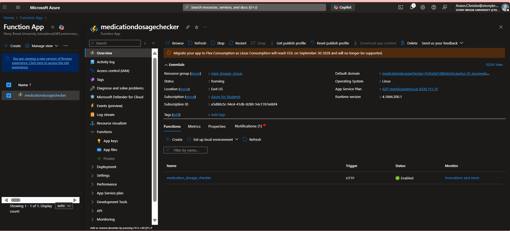
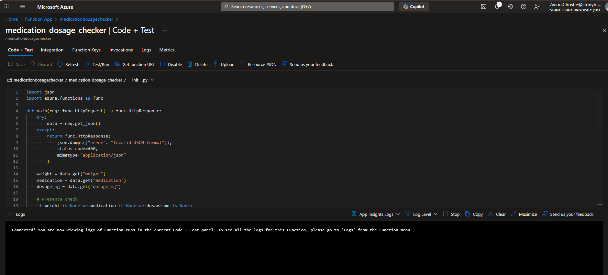
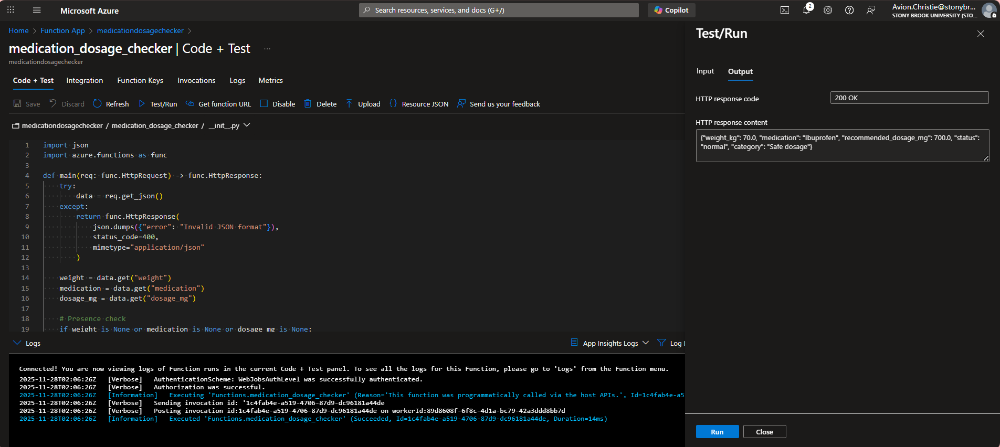
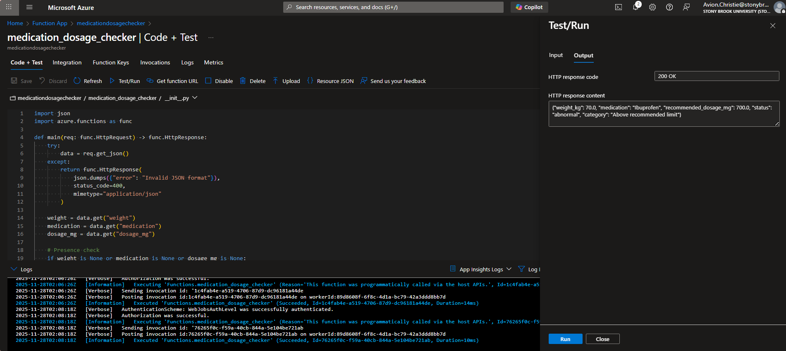
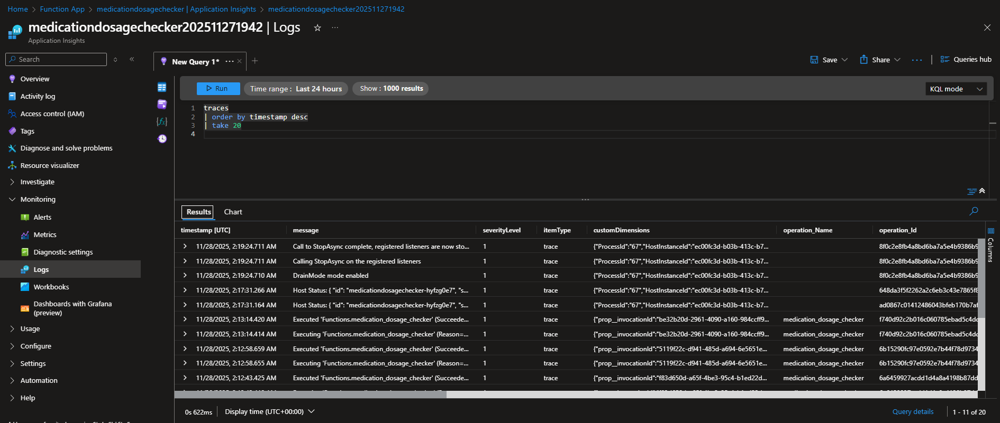
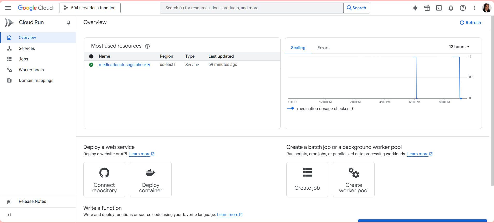
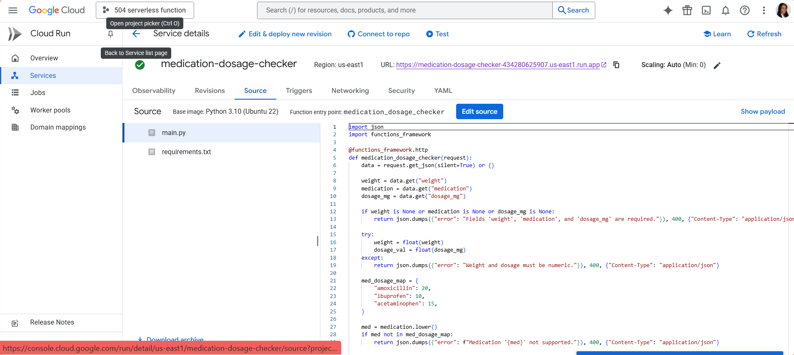
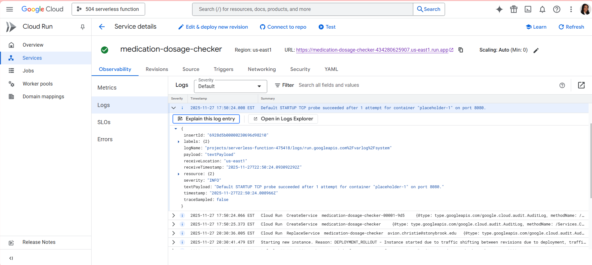
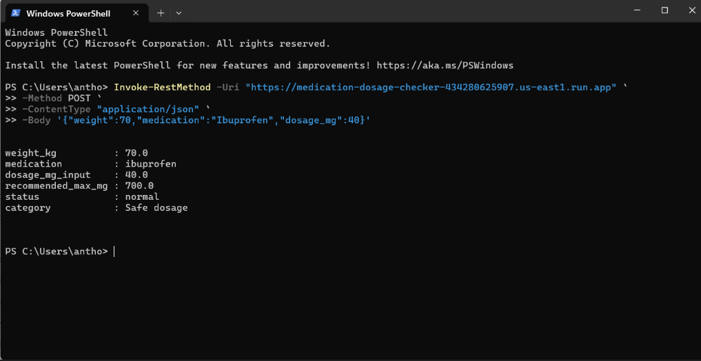
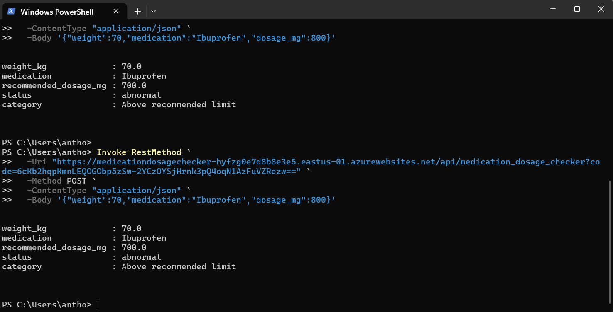

# Cloud Environments and Regions Used

# Cloud	                        	                            Runtime     Region
# Microsoft Azure   Azure Functions (Consumption Plan, Windows)	Python 3.10	East US
# Google Cloud      Cloud Functions 2nd Gen (Cloud Run)	        Python 3.10	us-east1

# ---------------------------------------------------------
# Deployment Steps

# Azure Deployment
# Created Function App (Windows, Python 3.10, Consumption plan).
# Enabled public HTTP trigger, created function named medication_dosage_checker.
# Pasted function code into __init__.py.
# Added test JSON via Code + Test.
# Verified response & logs through Application Insights.

# --------------------------------------------
# Google Cloud Deployment

# Created a new 2nd Gen Cloud Function, HTTP trigger.
# Set entry point medication_dosage_checker.
# Added code in inline editor.
# Added functions-framework in requirements.txt.
# Clicked Deploy → tested with PowerShell.
# Checked Cloud Run logs.

# -----------------------------------------------------------------------
# Public Endpoint URLs + Authentication Notes

# Azure URL
# Authentication: Function key required
# https://medicationdosagechecker-hyfzg0e7d8b8e3e5.eastus-01.azurewebsites.net/api/medication_dosage_checker?code=YOUR_KEY

# ------------------------------------------------------------------------
# Google Cloud URL
# Authentication: Unauthenticated (public)
# https://medication-dosage-checker-434280625907.us-east1.run.app

# -------------------------------------------------------------------
# Comparison: Azure vs Google Cloud

# Azure Functions (Consumption Plan)
# Easier to debug with “Code + Test” panel
# Automatic portal editor, Application Insights logs
# More steps required (Function App → Function → Keys → Host settings)
# Stricter structure (__init__.py, function.json)

# Google Cloud Functions (2nd Gen)

# Much faster deployments
# Cleaner inline editor
# Cloud Run backend handles scaling more smoothly
# Logs are easier to interpret in Cloud Run
# Requirements.txt is simpler

# Screen Shots 

# Azure 1 
#  

# 2 
# 

# 3
# 

# 4
# 

# 5
#  

# ---------------------------------------------------

# Google Cloud Screen Shots

# 1
# 

# 2
# 

# 3
# 

# 4
 

# 5
# 